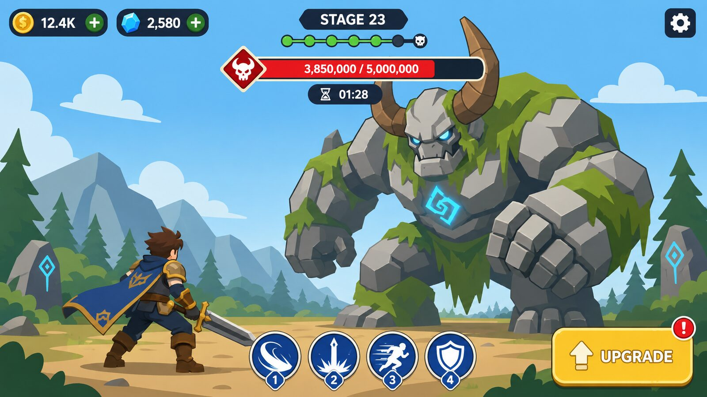

# 2026Clicker

> 2026년에 클리커는 재밌을까?

## 프로젝트를 시작한 이유

`2026Clicker`는 “2026년에도 클리커 게임은 여전히 재미있을까?”라는 단순한 질문에서 시작했습니다. 익숙하고 직관적인 클릭이라는 행위가 오늘날의 플레이 환경에서도 충분한 몰입감과 성장의 즐거움을 줄 수 있는지, 작은 게임을 직접 완성하며 확인해 보려는 프로젝트입니다.

동시에 이 프로젝트는 Unity CLI와 Codex를 실제 Unity 개발 과정에 활용하는 학습이자 실험이기도 합니다. 기획을 구체화하고, Scene과 UI를 구성하고, 코드를 작성하고, Editor에서 결과를 검증하는 일련의 과정에서 두 도구가 개발자를 얼마나 효과적으로 보조할 수 있는지 살펴봅니다. 단순히 게임 하나를 만드는 데서 그치지 않고, 사람과 AI가 함께 작업하는 더 나은 개발 흐름을 찾아가는 것을 또 하나의 목표로 삼습니다.

아래 내용은 이 실험을 통해 만들어 갈 간단한 클리커 게임의 기획 문서입니다. 게임의 방향과 구현 범위가 바뀌면 이 문서도 함께 갱신합니다.

게임 수치 중 데이터 테이블로 관리할 항목은 [데이터 테이블 설계 메모](Docs/DataTables.md)에 별도로 기록합니다. 큰 숫자의 단위 선택, 소수점과 문자 단위 생성 규칙은 [큰 숫자 표기 규칙](Docs/NumberNotation.md)을 기준으로 합니다.

## 현재 샘플 구현

`Assets/Sample`에는 Unity CLI와 Codex를 이용해 제작한 클리커 게임 UI 프로토타입이 들어 있습니다. 레퍼런스 게임인 **Tap Titans 2**의 메인 전투 화면에서 정보 구조를 참고했으며, 원본 아트나 로고를 복제하지 않고 Unity UGUI 기본 스프라이트와 단순한 색상으로 화면 구성을 재현했습니다.

### 파일 구성

| 파일 | 역할 |
| --- | --- |
| `Assets/Sample/SampleScene.unity` | 탭타이탄 스타일의 세로형 전투 UI 샘플 |
| `Assets/Sample/TapDamageDemo.cs` | 화면 터치와 플로팅 데미지 연출을 담당하는 샘플 스크립트 |

샘플용 코드는 실제 게임 코드와 구분할 수 있도록 `Sample` 네임스페이스를 사용합니다.

### 화면 구성

- 상단 재화, 스테이지 및 진행도 HUD
- 보스 이름과 HP 게이지
- 중앙 타이탄, 영웅, 펫 더미 오브젝트
- 영웅 DPS 및 강화 카드
- 액티브 스킬 버튼과 하단 메뉴 탭
- 1080×1920 세로 화면 기준 Canvas
- UGUI 기본 `UISprite`, `Background`, `Knob` 스프라이트
- TextMesh Pro 기반 UI 텍스트

### 터치 데미지 샘플

Play Mode에서 화면을 터치하거나 클릭하면 `TapDamageDemo`가 입력을 감지합니다. 입력할 때마다 보스 위치에서 `12.8K!` TMP 텍스트가 생성되고, 위로 이동하면서 서서히 사라집니다. 연속 입력 시 각 데미지 텍스트는 독립적으로 재생됩니다.

현재 구현은 UI와 입력 피드백을 확인하기 위한 프로토타입입니다. 보스 HP 감소, 재화 획득, 실제 강화 구매 및 데이터 저장은 아직 연결하지 않았습니다.

## 1. 게임 개요

| 항목 | 내용 |
| --- | --- |
| 장르 | 클리커 / 방치형 |
| 레퍼런스 | Tap Titans 2 |
| 플랫폼 | 미정 |
| 플레이 방식 | 화면을 터치해 몬스터를 공격하고, 처치 보상으로 캐릭터를 강화해 스테이지를 진행한다. |
| 목표 플레이 시간 | 미정 |
| 핵심 재미 | 짧은 조작, 전투 피드백, 빠르게 커지는 피해량과 성장의 만족감 |

## 2. 핵심 콘셉트

- 한 줄 소개: 터치 공격과 반복 성장을 통해 보스를 돌파하는 소규모 클리커 게임
- 테마 및 세계관: 미정
- 차별점: 미정
- 주요 대상 플레이어: 미정

## 3. 핵심 게임 루프

1. 전투 화면을 터치해 캐릭터로 몬스터를 공격한다.
2. 몬스터를 처치하고 기본 재화를 획득한다.
3. 한 스테이지의 일반 몬스터 10마리를 처치하면 보스에게 도전한다.
4. 보스를 제한시간 30초 안에 처치하면 다음 스테이지로 이동한다.
5. 제한시간 안에 처치하지 못하면 해당 스테이지의 일반 몬스터 10마리를 순서대로 반복 전투한다.
6. 반복 전투로 재화를 모아 강화한 뒤 `보스와 전투` 버튼으로 다시 도전한다.
7. 추후 동료와 유사한 자동 전투 기능을 해금해 수동 터치 전투를 보조한다.

## 4. 재화

| 재화 | 획득 방법 | 사용처 | 비고 |
| --- | --- | --- | --- |
| 기본 재화 | 일반 몬스터 및 보스 처치 | 캐릭터와 향후 자동 전투 요소 강화 | 이름 미정 |
| 특수 재화 | 업적, 초기화, 특별 보상 | 영구 강화 | 도입 여부 미정 |

### 큰 숫자 표기

전투 피해량, 보유 재화, 강화 비용처럼 매우 큰 값은 `BigNumber`로 관리하고 다음 기본 정책으로 UI에 표시합니다.

| 항목 | 확정 규칙 |
| --- | --- |
| 단위 승격 | 2to4: 다음 단위의 정수부가 두 자리가 될 때 승격 |
| 소수부 | 소수점 아래 1자리 고정, 후행 0 유지 |
| 고정 단위 | `K, M, B, T` |
| 문자 단위 | `aa...zz → Aa...Zz → AA...ZZ` |
| 무제한 확장 | `ZZ` 이후 `aaa...zzz → Aaa...Zzz → AAA...ZZZ` 순으로 글자 길이 증가 |

2to4 정책은 단위가 1,000배마다 존재하더라도 다음 단위의 정수부가 한 자리라면 이전 단위를 유지합니다.

```text
3,123,456   → 3123.5K
9,999,999   → 9999.9K
10,000,000  → 10.0M
10^15       → 1000.0T
10^16       → 10.0aa
```

정수부가 최대 네 자리까지 표시되므로 UI 가독성을 위해 소수부는 한 자리만 사용합니다. 문자 단위는 코드에 전체 목록을 저장하지 않고 알파벳 조합으로 자동 생성하며 대소문자를 구분합니다.

단위 인덱스, 자동 생성 알고리즘, 반올림 후 단위 승격, 테스트 경계값과 참고 자료는 [큰 숫자 표기 규칙](Docs/NumberNotation.md)에 상세히 기록합니다.

## 5. 성장 시스템

### 터치 공격 강화

- 터치 1회당 피해량을 증가시킨다.
- 가격 증가 공식: 미정
- 최대 레벨: 미정

### 자동 전투

- 수동 터치로 진행하다가 추후 해금하는 기능이다.
- Tap Titans의 동료처럼 전투를 자동으로 보조하는 방향을 고려한다.
- 현재 MVP에서는 구현하지 않는다.
- 해금 조건, 공격 주기, 피해량 및 강화 방식: 미정
- 오프라인 보상 도입 여부: 미정

### 초기화 및 영구 성장

- 일정 조건을 달성하면 진행도를 초기화하고 영구 보상을 얻는다.
- 도입 여부와 해금 조건: 미정

## 6. 콘텐츠

- 강화 항목: 터치 공격 강화 우선, 나머지 미정
- 단계 및 지역: 일반 몬스터 10마리와 보스 1마리로 구성된 스테이지
- 업적: 미정
- 일일 보상: 미정
- 이벤트: 미정

## 7. 화면 구성

### 메인 전투 화면

#### 필드

- 플레이어 캐릭터
- 현재 전투 중인 몬스터 또는 보스
- 스테이지 배경

#### UI

- 몬스터 이름과 체력바
- 현재 스테이지와 일반 몬스터 진행도
- 터치 공격 시 표시되는 플로팅 데미지
- 캐릭터 스킬 버튼
- 현재 보유 재화
- 업그레이드 버튼
- 보스 전투 중 체력바 아래에 표시되는 제한시간
- 보스 실패 후 반복 전투 중 체력바 위에 표시되는 `보스와 전투` 버튼

### 전투 화면 카메라 및 비주얼 콘셉트



> 위 이미지는 구도와 시각적 방향을 확인하기 위한 16:9 콘셉트입니다. 이미지에 표시된 아트, UI 수치와 세부 배치는 최종 사양이 아니며, 목표 플랫폼과 최종 화면 방향은 별도로 결정합니다.

- Tap Titans의 캐릭터와 몬스터 간 크기 대비를 유지하면서, 서로를 대각선으로 바라보는 3/4 전투 구도를 사용한다.
- 플레이어 캐릭터는 화면 좌측 하단에 배치하고 우측 상단을 바라보는 3/4 후면으로 표현한다.
- 몬스터는 화면 중앙에서 약간 우측에 크게 배치하고 좌측 하단을 바라보는 3/4 정면으로 표현한다.
- 캐릭터와 몬스터는 같은 지면 위에 서 있는 것처럼 배치해 전투 공간의 깊이와 방향성을 전달한다.
- 몬스터는 전투 화면의 주요 터치 대상이자 시각적 중심으로 유지하며, 특히 보스는 캐릭터보다 압도적으로 크게 표현한다.
- 아트와 UI는 모던하고 심플한 형태를 지향한다.
- 캐릭터, 몬스터, 배경과 UI의 경계를 쉽게 구분할 수 있도록 선명한 실루엣과 제한된 색상을 사용한다.
- 각 요소는 단색 중심의 넓은 색면으로 표현하고, 복잡한 질감·장식·그라데이션은 최소화한다.
- 배경의 채도와 디테일은 전투 대상보다 낮춰 캐릭터와 몬스터의 가독성을 우선한다.

### 전투 화면 동작

- 전투 영역을 터치하면 캐릭터가 공격 애니메이션을 재생한다.
- 공격이 적중하면 몬스터가 피격 모션을 재생하고 플로팅 데미지가 표시된다.
- 피해량만큼 몬스터 체력이 감소한다.
- 일반 몬스터를 처치하면 기본 재화를 획득하고 다음 몬스터가 등장한다.
- 한 스테이지의 일반 몬스터 10마리를 처치하면 보스가 등장한다.
- 보스를 30초 안에 처치하면 다음 스테이지로 이동한다.
- 보스 공략에 실패하면 같은 스테이지의 일반 몬스터 10마리를 1번부터 10번까지 순서대로 반복한다.
- 반복 전투 중에는 보스가 자동으로 재등장하지 않으며, 플레이어가 `보스와 전투` 버튼을 눌러 재도전한다.

### 강화 화면

- 강화 이름과 현재 레벨
- 현재 효과와 다음 단계 효과
- 구매 가격
- 구매 가능 여부

### 설정 화면

- 배경음 및 효과음 조절
- 데이터 저장 및 초기화
- 게임 정보

> UI 텍스트는 기본적으로 TextMesh Pro(TMP)를 사용합니다.

## 8. 연출 및 사운드

- 터치 공격 피드백: 캐릭터 공격 모션, 몬스터 피격 모션, 플로팅 데미지, 파티클 등
- 몬스터 처치 피드백: 재화 드롭 및 획득 연출
- 보스 전투 피드백: 제한시간과 실패·성공 상태를 명확하게 표시
- 구매 피드백: 성공 및 재화 부족 상태를 명확하게 표시
- 배경음 콘셉트: 미정
- 효과음 콘셉트: 미정

## 9. 밸런스 기준

| 항목 | 현재 기준 |
| --- | --- |
| 스테이지당 일반 몬스터 수 | 10마리, 보스 제외 |
| 보스 제한시간 | 30초 |
| 보스 실패 후 반복 순서 | 해당 스테이지 일반 몬스터 1번부터 10번까지 순환 |
| 초반 첫 강화 도달 시간 | 미정 |
| 터치당 기본 피해량 | 미정 |
| 자동 전투 최초 해금 시점 | 미정 |
| 강화 가격 증가율 | 미정 |
| 초기화 가능 시점 | 미정 |

주요 수치는 플레이 테스트 결과에 따라 조정합니다. 밸런스 공식과 값은 코드에 직접 분산하지 않고 별도의 설정 데이터로 관리하는 것을 우선합니다. 세부 항목과 결정 상태는 [데이터 테이블 설계 메모](Docs/DataTables.md)를 기준으로 관리합니다.

## 10. 저장 데이터

- 현재 스테이지와 진행 상태
- 현재 전투 상태
- 보유 재화
- 강화 레벨
- 해금한 콘텐츠
- 마지막 저장 시각
- 설정값

저장 방식, 보스 전투 중 종료 처리, 타이머 복원 정책은 추후 결정합니다.

## 11. 최소 구현 범위(MVP)

- [ ] 터치 입력과 캐릭터 공격
- [ ] 몬스터 체력, 피격 및 처치 처리
- [ ] 플로팅 데미지
- [ ] 일반 몬스터 10마리 진행
- [ ] 처치 재화 획득 및 보유 재화 UI
- [ ] 보스 등장, 30초 타이머, 성공 및 실패 처리
- [ ] 일반 몬스터 반복 전투와 `보스와 전투` 버튼
- [ ] 터치 공격 강화 1종과 가격 증가
- [ ] 게임 데이터 저장 및 불러오기
- [ ] 기본 공격·처치·구매 피드백

## 12. 제외 범위

첫 번째 플레이 가능한 버전에서 구현하지 않을 기능을 기록합니다.

- 동료 형태의 자동 전투
- 오프라인 보상
- 초기화 및 영구 성장
- 업적, 일일 보상, 이벤트
- 광고 및 인앱 결제

## 13. 개발 원칙

- 작은 기능 단위로 구현하고 Unity Editor에서 동작을 검증한다.
- UI 텍스트는 별도 요청이 없다면 TMP를 사용한다.
- 게임 수치와 화면 표현 로직을 가능한 한 분리한다.
- 테이블 관리 대상 값은 코드에 하드코딩하기 전에 [데이터 테이블 설계 메모](Docs/DataTables.md)에 기록한다.
- 기능 추가 시 Console 오류와 활성 Scene의 Hierarchy를 확인한다.

## 14. 결정 기록

| 날짜 | 결정 | 이유 |
| --- | --- | --- |
| 2026-08-22 | Tap Titans를 메인 전투 화면과 전투 흐름의 레퍼런스로 삼는다. | 소규모 클리커 게임의 전투·성장 구조를 구체화하기 위해 |
| 2026-08-22 | 한 스테이지는 일반 몬스터 10마리 이후 보스로 구성한다. | 초기 규칙을 단순하고 명확하게 유지하기 위해 |
| 2026-08-22 | 보스 제한시간의 초기값은 30초로 한다. | 플레이 테스트 전 사용할 기본값이 필요하기 때문에 |
| 2026-08-22 | 보스 실패 후 같은 스테이지의 일반 몬스터 10마리를 순서대로 반복한다. | 재화를 모아 강화한 뒤 다시 도전하는 루프를 만들기 위해 |
| 2026-08-22 | 자동 전투는 추후 해금 기능으로 두고 현재 MVP에서 제외한다. | 우선 수동 터치 전투의 재미와 구현을 검증하기 위해 |
| 2026-08-22 | 플레이어 좌측 하단 3/4 후면, 몬스터 중앙 우측 3/4 정면의 대각선 전투 구도를 사용한다. | 크기 차이를 유지하면서 전투 공간의 깊이와 방향성을 표현하기 위해 |
| 2026-08-22 | 전투 화면은 모던하고 심플한 단색 중심의 비주얼을 지향한다. | 요소별 경계와 전투 정보를 작은 화면에서도 명확하게 구분하기 위해 |
| 2026-08-23 | 큰 숫자는 2to4 단위 승격, 소수점 아래 1자리 고정으로 표시한다. | 다음 단위의 한 자리 숫자가 작아 보이는 현상을 줄이고 네 자리 정수부와 UI 길이의 균형을 맞추기 위해 |
| 2026-08-23 | `K, M, B, T` 이후 문자 단위를 소문자, 첫 글자 대문자, 전체 대문자 순으로 자동 생성하고 글자 길이를 확장한다. | `BigNumber`의 무제한 범위에 맞춰 수동 단위 목록 없이 확장하기 위해 |

## 15. 미결정 사항

- 게임의 구체적인 테마와 이름
- 목표 플랫폼과 화면 방향
- 핵심 재화의 명칭
- 터치 피해가 적용되는 정확한 애니메이션 시점
- 반복 전투 도중 `보스와 전투` 버튼을 누를 때의 전환 시점
- 보스 재도전 시 체력 초기화 및 재도전 비용 정책
- 보스 전투를 제한시간 전에 포기할 수 있는지 여부
- 자동 전투의 해금 조건과 동료 시스템 구조
- 초기화 시스템 도입 여부
- 광고 및 인앱 결제 도입 여부
